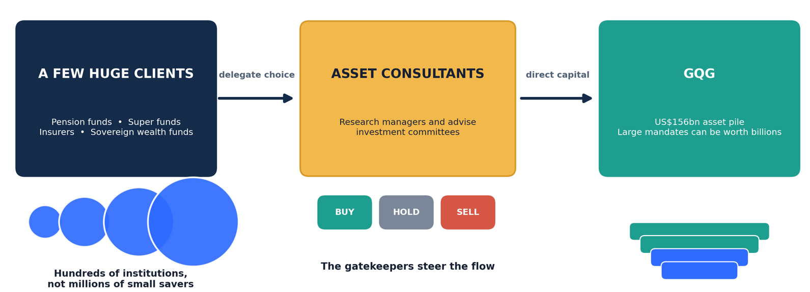

# About Funds

## Part One — What A Fund Manager Actually Sells 

### 1. A promise, not a product 

A bakery sells bread. You can see it, smell it, and know within a minute whether it was any good. A fund manager sells something you cannot inspect at all: a promise to make sensible decisions with your money. 

You only discover whether that promise was worth anything years later — and even then you can't be certain, because a bad decision can get lucky and a good one can look wrong for a very long time. Almost everything strange about this industry follows from that one fact. 

### 2. It gets paid rent, not a share of the winnings 

This surprises most people. A fund manager does not mainly take a cut of the profits it makes for you. It charges a small percentage of however much money is sitting with it, every year, whether that year was good or bad. 

A firm holding $156bn and charging 0.5% earns around $800m a year before it has proved anything. Think of a car park rather than a taxi company: you don't earn from where the cars go, only from how many are parked and how long they stay. 

This is not one firm's quirk. It is the standard model for the entire traditional industry — BlackRock, Vanguard, Fidelity, Capital Group, T. Rowe Price, all of them. What varies is the rate, not the mechanism. Index funds might charge 0.03–0.20%, mainstream active equity funds 0.4–1.0%, specialists more. 

The exception sits at the other end of the industry. Hedge funds and private equity firms add a performance fee on top — the classic "2 and 20" being 2% a year plus 20% of the gains, usually only above a hurdle and subject to a high-water mark so they can't be paid twice for recovering the same losses. 

### 3. The gatekeepers 

Big fund managers are not funded by ordinary savers. Their money comes from a few hundred enormous institutions — pension funds, insurers, sovereign wealth funds — any one of which might place several billion dollars. 

Those institutions mostly don't choose managers themselves. They hire specialist advisers, called asset consultants, whose whole job is to research fund managers and rate them Buy, Hold or Sell. Firms like Mercer, Willis Towers Watson and JANA, plus retail-facing raters like Morningstar and Lonsec, effectively steer where the world's institutional money flows. Win their approval and money arrives. Get downgraded and it leaves. 

So a fund manager's real customers are not the public. They are a few dozen investment committees and the consultants advising them. 

Two things worth knowing if you're tempted to lean on these ratings yourself. They rate *funds and managers*, not individual stocks. And the serious institutional research is paywalled — only Morningstar and Lonsec are partly public. 

People put money in, for example, retirement funds, then these funds ask consultants "hey, excuse me, do you know which fund manager can take care of my money better", and the consultant goes "sure, GQG is a good one", then the retirement fund gives its money to GQG and GQG in return asks its own analysts "hey, where do you think we should put all this money". One nuance: the consultant advises the pension fund's investment committee, which makes the final call. So GQG must win over both; and since a few consultants steer most institutional money, their ratings largely determine whether GQG's pile grows or shrinks.

---

## Part Two — Does Any Of It Work? 

### 4. The uncomfortable numbers 

Roughly 85–90% of active funds fail to beat their benchmark over fifteen years. That is the headline finding, repeated year after year. 

The gatekeepers don't rescue the situation either. A well-known 2016 study by Jenkinson, Jones and Martinez examined consultants' recommendations and found no measurable outperformance against benchmarks. Morningstar's star ratings are similarly weak at predicting future returns. 

### 5. So why does the money still go there? 

Mostly for reasons that have nothing to do with returns. 

Start with the machinery. A pension board hires a consultant, the consultant produces a shortlist, the board interviews managers and votes. That entire apparatus exists to demonstrate diligence. If the answer were "buy the index and go home", the consultant, the committee and half the investment team become unnecessary. Nobody in that chain is paid to reach that conclusion. 

Then career asymmetry. A trustee who indexes and matches the market receives no credit. One who backs a manager that blows up is blamed personally. "We followed a rated process" is a complete defence at an inquiry. 

There are honest arguments too. The 85–90% failure figure is measured after retail fees; a $2bn institutional mandate might pay 0.35% rather than 1%, which shifts the maths. Some asset classes have no investable index at all. And some institutions genuinely want to avoid the concentration in a handful of giant technology names that dominate the main indices. 

Finally, money is sold, not bought. Retail flows arrive through advisers and platforms with their own incentives, and past performance still sells. 

---

## Part Three — Where It Is All Heading 

### 6. The three shops 

Picture three shops on one street. 

**Shop One** sells index funds for almost nothing. Most people now shop here. It wins on customers, but charges so little that only giants like Vanguard and BlackRock can survive on the margins. 

**Shop Two** sells traditional stock-picking funds. Not cheap enough to compete with the first, not special enough to compete with the second. This is the shop being hollowed out, which is why these firms keep merging — Franklin buying Legg Mason, Standard Life with Aberdeen, Janus with Henderson. Scale or die. 

Three large caveats, because these numbers are the most flattered in finance. 

- They're quoted as IRR, which isn't comparable to the annual return on a share portfolio. It can be inflated by borrowing to delay calling investors' capital, and by the timing of when money goes in and out. 
- The firms value their own assets, quarterly, using their own models. So the returns look smooth and the risk looks low largely because nobody is marking them to a live market. Cliff Asness calls this volatility laundering. 
- And much of the return is simply borrowed money amplifying an ordinary business. Ludovic Phalippou's research argues that, net of fees, private equity has roughly matched public small-cap indices since 2006 — while making a remarkable number of its managers billionaires. 

**Shop Three** sells things you cannot buy off a shelf — private companies, toll roads, private loans. There is no index for these, so nobody can copy them cheaply. These firms still charge fat fees and are booming. Blackstone, Apollo and KKR live here. 

So the industry is not dying. Total money invested keeps rising. It is shifting from the middle to the two ends. Passive overtook active in US equity funds around 2024, yet the overall pie grew because markets rose and savings grew faster than investors defected. 

### 7. Who actually sets the prices? 

An index fund buys every company on a list without asking whether any of them is any good. It simply accepts whatever price is showing. So somebody has to be setting those prices. 

The tempting conclusion is that Shop Three is doing that work, and therefore can never disappear. That argument is weaker than it sounds. Price discovery does not need the fund management industry. It needs *someone* with capital and a motive — and that is now largely hedge funds, computer-driven trading firms and market makers, who do the job with a fraction of the capital traditional funds hold. Add corporate insiders, activists and acquirers, who move prices simply by transacting. A long-only manager charging 0.5% to quietly hug a benchmark contributes almost nothing. 

Markets are efficient because of all participants, not because of Shop Three. 

There is still a floor, though, and it's about cost. For a mega-cap followed by forty analysts, any capable person spots a gap almost instantly. For a small, illiquid company nobody follows, digging through the filings costs real time — and correcting a mispricing on a huge stock takes serious size, not a retail account. So the work never stops entirely. It just concentrates into fewer, sharper hands, and the floor sits far lower than the industry's defenders claim. 

### 8. The other end of the street 

Three terms worth defining plainly. 

A **hedge fund** is a private pool of money from wealthy individuals and institutions, with few restrictions on what it may do. It can bet on prices falling, borrow heavily, trade almost anything. It charges a base fee plus a large slice of profits. 

A **quant shop** is a hedge fund that replaces human judgement with computer models. Mathematicians and programmers build systems that scan enormous quantities of data for patterns and trade automatically, often thousands of times a day. 

A **market maker** is the middleman standing ready to both buy and sell at any moment, so you never have to wait for someone wanting the other side of your trade. It earns a sliver on each one. Citadel Securities is the best-known example. 

A note on the name. "Hedge" comes from hedging your bets — and originally from hedgerows, since a hedge is a boundary that fences things in. The first such fund is usually credited to Alfred Winslow Jones in 1949. He bought the stocks he liked and bet against the ones he didn't, at roughly equal size, so a market-wide crash would see his losses on one side offset by gains on the other. Only his stock-picking would matter. The label is now badly misleading: plenty of modern hedge funds are heavily borrowed, concentrated, one-directional bets that are riskier than an ordinary fund. 

---

## Part Four — The Winners 

### 9. The ones who genuinely beat it 

They exist, and the list is short. 

The extreme case is Renaissance Technologies' Medallion Fund, which averaged roughly 66% a year before fees and about 39% after, from 1988 to 2018, on fees of around 5% of assets plus 44% of profits. It reportedly hasn't had a losing year since 1990 and made roughly 80% net in 2008 while everything else collapsed. 

Beyond that: Berkshire Hathaway at around 20% a year for nearly sixty years, which is the most impressive of all given the duration and sheer size. Soros's Quantum Fund at roughly 30% across three decades. Julian Robertson's Tiger Management at about 25% from 1980 to 1998. Joel Greenblatt's Gotham Capital reportedly at 50% for ten years, after which he handed the money back. Citadel's flagship near 19% since 1990. Millennium around 14% net since 1989. Peter Lynch at 29% for thirteen years at Fidelity Magellan. Seth Klarman's Baupost in the high teens for decades. 

Three warnings. Survivorship bias is severe — these names are known precisely because they worked, and the thousands who failed go unwritten. Several achieved it with leverage or concentration that would have destroyed them on a different sequence of events. And calibrate against the benchmark: the S&P 500's long-run average is around 10% a year, but roughly 13% since 2010. Twelve per cent has not been a high bar recently. Over a full century it is. 

### 10. The tell 

Notice how many of those funds are closed, capped, or handed capital back. Medallion is employee-only and capped near $10bn. Greenblatt returned the money. That pattern is the single most useful signal in the whole industry. 

A genuine inefficiency has a fixed size. Find $500m worth of mispricing, take in $5bn, and your own buying moves the price against you until the returns collapse. So anyone with a real edge must eventually refuse money to protect it. 

That is the tell, because refusing money is expensive. Managers are paid a percentage of the pile — closing the fund means turning down guaranteed revenue forever. Almost nobody does that unless diluting the returns would cost them more, which is only true when their pay is tied to performance or their own wealth sits inside the fund. 

The inverse is the practical lesson. A fund happy to take every dollar you offer, indefinitely, is telling you its business is gathering assets rather than generating returns. 

### 11. The invisible winners 

If edges must stay small and quiet, is beating the market more common than the statistics suggest? 

Probably, a little. The published data covers registered funds obliged to report. It cannot see family offices, private partnerships or individuals. Some of the most profitable trading operations on earth — Jane Street, Jump, SIG, Hudson River — take no outside money, disclose nothing, and appear in no study. Silence is rational: publicity buys you nothing and invites competition into a finite opportunity. 

But silence is also exactly what losing looks like, and losers are quieter still. The theory can't be tested, which makes it comfortable to hold and expensive to act on. 

There is also a hard arithmetic constraint, made famous by William Sharpe. All investors together *are* the market, so before costs the average active dollar earns precisely the market return, and after costs, less. One investor's outperformance is necessarily another's shortfall. That is an identity, not a finding. 

The escape hatch is subtle but real: that arithmetic constrains *dollars*, not *people*. Thousands of small players quietly beating the market is entirely consistent with it — provided their pots stay small and the dollars they take come from large, slow institutions. 

---

## Part Five — Could You Do It Yourself? 

The honest answer has to be split into the parts that hold up and the parts that don't. 

**What holds up.** That something has been done for decades proves it is possible in principle — this is not a law of physics forbidding it. Small capital is a genuine advantage, not a handicap. Medallion caps itself precisely because its opportunities are tiny. With a small account you have no clients, no benchmark, no redemptions, no quarterly review, and you can examine companies too small for any institution to bother with. Buffett has said he could compound at 50% a year on small sums, and he meant it. And yes, anyone succeeding would keep quiet, which is exactly why the data is incomplete. 

**What doesn't.** Raw intelligence is the weakest plank. Your comparison group is not the general population — it is whoever sits on the other side of your trades, and they are selected, not random. Long-Term Capital Management had two Nobel laureates and lost $4.6bn in four months. Buffett's line was that if you have an IQ of 150 in this business you should sell thirty points, meaning temperament dominates past a fairly low threshold. 

Be careful with claims about how clever the competition is, including mine. Nobody IQ-tests trading firms, so figures like "the median quant is around 130" are inferences from credentials, not measurements. What *is* documented is the hiring: Renaissance was built on maths and physics PhDs, and firms like Jane Street and Citadel Securities recruit openly from International Maths Olympiad medallists, which is territory far beyond the top 2%. 

Mathematical and computing skill is necessary but nowhere near sufficient. Retail quant attempts usually die on data quality, transaction costs and overfitting, not on ability. Backtests are extraordinarily easy to fool yourself with. 

And the real hazard is not intelligence at all. Intelligence breeds conviction, conviction breeds position size, and size breeds ruin — and ruin is absorbing. One wipeout ends the compounding permanently, no matter how good the process was. 

Which suggests the cheapest possible experiment. Run it small for two years. Log every trade honestly against the index, including costs. Then decide. 

#FUNDs

