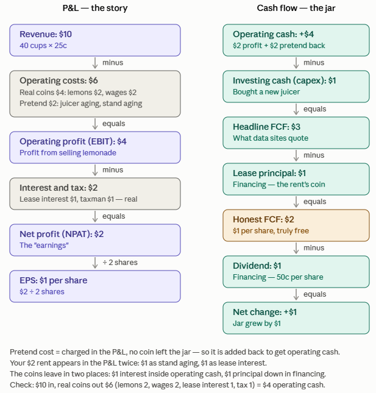

# Accounting

## Operating Cash Flow

Imagine a lemonade stand.

**Cash**: Money in the jar. Every day, coins come in from customers and go out for lemons. What's left in the jar is *cash*.

**Operating cash flow**: coins that actually entered and left the jar *from selling lemonade*. It's the slice from running the business itself — fees in, wages out. It excludes borrowing, share issues, or buying buildings. So operating cash is one type of cash flow.

**Profit** is a *story*, not a jar. It's income earned minus costs incurred, *on paper*. Accountants don't just count coins. They add promises ("Bob will pay me Tuesday" counts as income *today*) and subtract pretend costs ("my juicer machine got older, that's -$50" — but no coin left the jar).

> Profit (EPS) tells you the story; cash tells you the truth. Check both.

Apart from expansion plans and other real reasons, is that why dividends per share are almost always different from EPS? I mean, E is story, D is truth.

Rule of thumb
> dividends consistently backed by cash flow = healthy. Dividends paid while cash shrinks = company borrowing to look generous — a classic red flag.

### Example

**FCF**: Free Cash Flow (not a standard accounting term, but widely used)
**Honest FCF**: just a made-up term in this chart. 

In the above example, $10, in total, genuinely came into my jar from my core business, $7 genuinely left my jar as a result of my core business: Lemons $2, wages $2, rent $1 and Interest and tax $2.

Operating cash also can be fake:
1. Intentionally delaying paying my suppliers
2. Delaying paying the rent for my stance
3. The governemt subcedided lemon juice so people ruch to buy 

Also, loss means I have "claimed" my costs was bigger than my revenue. However, that, too, can be an accounting trick for example by writing $2 for juicer aging instead of $1; or I can do a goodwill write-down trick.

#fundamental_analysis