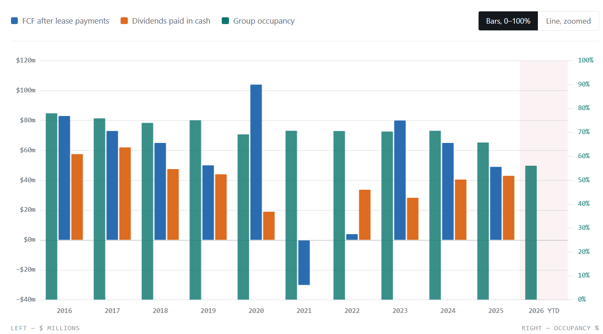

# GEM

## Business Model

They rent rooms + educators, then accept kids to educate them. educator per room is fixed by law, whether 1 kid shows up or 20. So, they have a **fixed cost**. This cost is proportionate to **seats available**. Because available seats dictate the size of the rooms as well as the number of educators. Revenue, however, is so wobbly! They charge per day per kid by the way. Their margin is also so thin. In FY25, from $948m revenue, only $93m survived as operating profit, a **skinny margin** of only ~10%. This margin is determined mostly by **occupancy** (seats filled ÷ seats available). 1% change in occupancy corresponded to $14m in 2025! Remember only $93m profit? So, only 7% fall in occupancy and business is in loss! Reminder: most of the cost is *fixed*, so, the whole business is so stressful! **What if kids don't show up**?! And that's actually what's happening! For two reasons: 1) Parents don't **trust** GEM anymore (one of educators raped kids!) 2) **Birth rate**! People don't want to have kids these days. (remember, this may take **a decade** to change)

### Good for business
- Government subsidies getting fatter
- Higher occupancy
  - Birth rate going up 
  - More parents take their kids to GEM

### Bad news
- Lower occupancy
  - Parents cutting a childcare day to save money (grandmas are a real risk to this industry!)
  - Parents losing trust in GEM in particular
  - Falling birth rates
  - Competitors building centres next door

#### Suburb Development
every time a new suburb is developed, GEM needs to make a decision: buy/lease the centre of 6 you'll lose a bit of market share. Developers build regardless. If GEM refuses the lease, a rival takes it and splits the pie. If GEM accepts everywhere, it overpays rent and cannibalises its own centres. Trap!

#### Laws that hit every centre at once

One law covers all centres, so one change moves the whole machine:

- **Subsidy cuts.** The government pays a big part of every parent's fee. Shrink the subsidy, or tighten the rules on who qualifies, and childcare gets pricier for every family overnight. Some pull their kids out. Occupancy falls nationwide.
- **Staff ratios.** Raise the required adults-per-child, and every centre must hire more staff. Costs jump everywhere.
- **Wage awards.** The government mandates pay rises for educators. Every centre pays.
- **Safety rules.** For example, mandatory CCTV. Every centre installs it.

Notice: the first cuts revenue, the rest raise fixed costs.

## What happened?!
In 2025 ABC's Four Corners program exposed a GEM educator had been raping kids. Parents panicked and occupancy went from 66% down to 56%. 

### What's goodwill write-down?
You buy a building and pay $10 knowing it's only worth $6 because you believe this location makes your business so good that it will pay for itself. Then, later on, you'll realise you've messed it up! But, your *balance sheet* still shows that you have an asset worth $10. That's a lie. You have to fix it, and you have to admit it to the stake holders. That is called a ***goodwill write-down***. It's like saying *I must admit my business isn't as good as I thought :(*. 

GEM management added a $349m goodwill write-down as a result of the damage to their reputation and fall in revenue and profit. That was a scary headline. 

### Which of GEM's competitors became happy?
Nobody! This was a damage to the entire industry! Parents didn't switch childcare brands; they switched to grandma.

## Real Free Cash Flow, Dividends and Occupancy
By *real free cash flow* we mean operating cash − capex − lease principal

This business has never been a cash machine. Ten-year average: $55m. Post-2019 average: $46m. The $168m headline never once turned into $168m of real money.

The wild swings aren't operational. **2020**'s $104m was COVID support ($263m of it) plus deferred rent. **2021**'s −$31m was paying that rent back plus peak capex. **2023**'s $80m was flattered by paying essentially zero tax that year. **2024** absorbed a $35m class action settlement (G8 got sued as a group, paid $35m compensation).

**2025**'s $50.1m is roughly a normal year for this company — which is the uncomfortable part, because it's a normal year with occupancy collapsing.

So your original claim, properly measured: 6.5c per share of real cash against a 14.5c price. About 2.2 years, not one — and only if next year matches this one, which management explicitly refuses to forecast.

Light blue bars use the pre-2019 rules, where rent was already inside operating cash — not strictly comparable, shown for context.

They usually paid out most of what they earned. In 2022 they handed over $33.7m from $4.0m of free cash. In 2016–2019 the payout ate 65–85% of it every year. Not much left over to strengthen the business.

One caveat on the early years. Before 2021 a chunk of the dividend was paid in new shares instead of coins (a reinvestment plan). Declared totals were far bigger — $90.8m in 2016, $77.5m in 2017. Cheaper on the jar, but it quietly minted extra shares, which is why the share count kept climbing.

2025 is the reckless one. $50.1m of free cash, and they sent out $43.0m of dividends plus $44.4m of buybacks — $87m against $50m earned, while occupancy was collapsing. That's why the jar shrank and why the dividend is now suspended and the buyback paused. The board spent 2025 money it didn't have, then stopped.

## How Fragile Is GEM?

Real numbers, CY25.

### Fixed and variable costs

Revenue **$947m**. Operating costs **$854m**. Operating EBIT **$93m**.

Roughly **$580m fixed** — rent, plus the minimum staff needed to keep a centre legally open. Roughly **$275m variable** — food, nappies, casuals you can send home.

G8 doesn't publish that split. It's my estimate. Every number below moves if it's wrong.

### Operating leverage

Contribution = revenue − variable costs = $947m − $275m = **$672m**

Degree of operating leverage = contribution ÷ operating EBIT

= $672m ÷ $93m = **7.2×**

Knock 1% off revenue, lose about 7% of EBIT.

### Break-even revenue

Contribution margin ratio = $672m ÷ $947m = **0.71**

Break-even revenue = fixed costs ÷ contribution margin ratio

= $580m ÷ 0.71 = **$820m**

### Margin of safety

$947m − $820m = $127m, or **13%**.

Revenue can fall 13% before EBIT hits zero. That's the whole tank.

### Where it's sitting now

Occupancy averaged 65.8% in 2025. By April 2026 it was **56.1%** — 15% fewer kids through the door.

$947m × 0.85 ≈ **$805m**. Below break-even.

Fee rises soften that, and 40 centre closures pull fixed costs down. So it's not as clean as the sum. But it's not far off either.

### Reality check

Actual 2025: revenue −7%, operating EBIT −19%. That's **2.7×**, not 7.2×.

The gap is management cutting. 7.2× is the number if you sit still. Nobody sits still — but you can only cut so fast.

#fundamental_analysis #Consumer_Services

