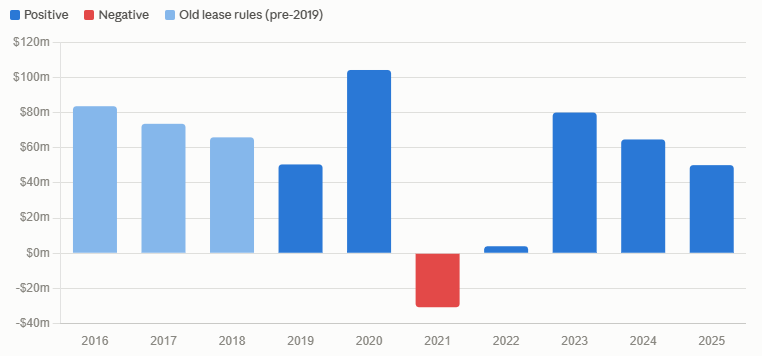

# GEM

## Business Model

They rent rooms + educators, then accept kids to educate them. educator per room is fixed by law, whether 1 kid shows up or 20. So, they have a **fixed cost**. This cost is proportionate to **seats available**. Because available seats dictate the size of the rooms as well as the number of educators. Revenue, however, is so wobbly! They charge per day per kid by the way. Their margin is also so thin. In FY25, from $948m revenue, only $93m survived as operating profit, a **skinny margin** of only ~10%. This margin is determined mostly by **occupancy** (seats filled ÷ seats available). 1% change in occupancy corresponded to $14m in 2025! Remember only $93m profit? So, only 7% fall in occupancy and business is in loss! Reminder: most of the cost is *fixed*, so, the whole business is so stressful! **What if kids don't show up**?! And that's actually what's happening! For two reasons: 1) Parents don't **trust** GEM anymore (one of educators raped kids!) 2) **Birth rate**! People don't want to have kids these days. (remember, this may take **a decade** to change)

### Good for business
- Government subsidies getting fatter
- Higher occupancy
  - Birth rate going up 
  - More parents take their kids to GEM

### Bad news
- Lower occupancy
  - Parents cutting a childcare day to save money (grandmas are a real risk to this industry!)
  - Parents losing trust in GEM in particular
  - Falling birth rates
  - Competitors building centres next door

## What happened?!
In 2025 ABC's Four Corners program exposed a GEM educator had been raping kids. Parents panicked and occupancy went from 66% down to 56%. 

### What's goodwill write-down?
You buy a building and pay $10 knowing it's only worth $6 because you believe this location makes your business so good that it will pay for itself. Then, later on, you'll realise you've messed it up! But, your *balance sheet* still shows that you have an asset worth $10. That's a lie. You have to fix it, and you have to admit it to the stake holders. That is called a ***goodwill write-down***. It's like saying *I must admit my business isn't as good as I thought :(*. 

GEM management added a $349m goodwill write-down as a result of the damage to their reputation and fall in revenue and profit. That was a scary headline. 

### Which of GEM's competitors became happy?
Nobody! This was a damage to the entire industry! Parents didn't switch childcare brands; they switched to grandma.

## Real Free Cash Flow
By *real free cash flow* we mean operating cash − capex − lease principal

This business has never been a cash machine. Ten-year average: $55m. Post-2019 average: $46m. The $168m headline never once turned into $168m of real money.

The wild swings aren't operational. 2020's $104m was COVID support ($263m of it) plus deferred rent. 2021's −$31m was paying that rent back plus peak capex. 2023's $80m was flattered by paying essentially zero tax that year. 2024 absorbed a $35m class action settlement.

2025's $50.1m is roughly a normal year for this company — which is the uncomfortable part, because it's a normal year with occupancy collapsing.

So your original claim, properly measured: 6.5c per share of real cash against a 14.5c price. About 2.2 years, not one — and only if next year matches this one, which management explicitly refuses to forecast.

Light blue bars use the pre-2019 rules, where rent was already inside operating cash — not strictly comparable, shown for context.

#fundamental_analysis #Consumer_Services

