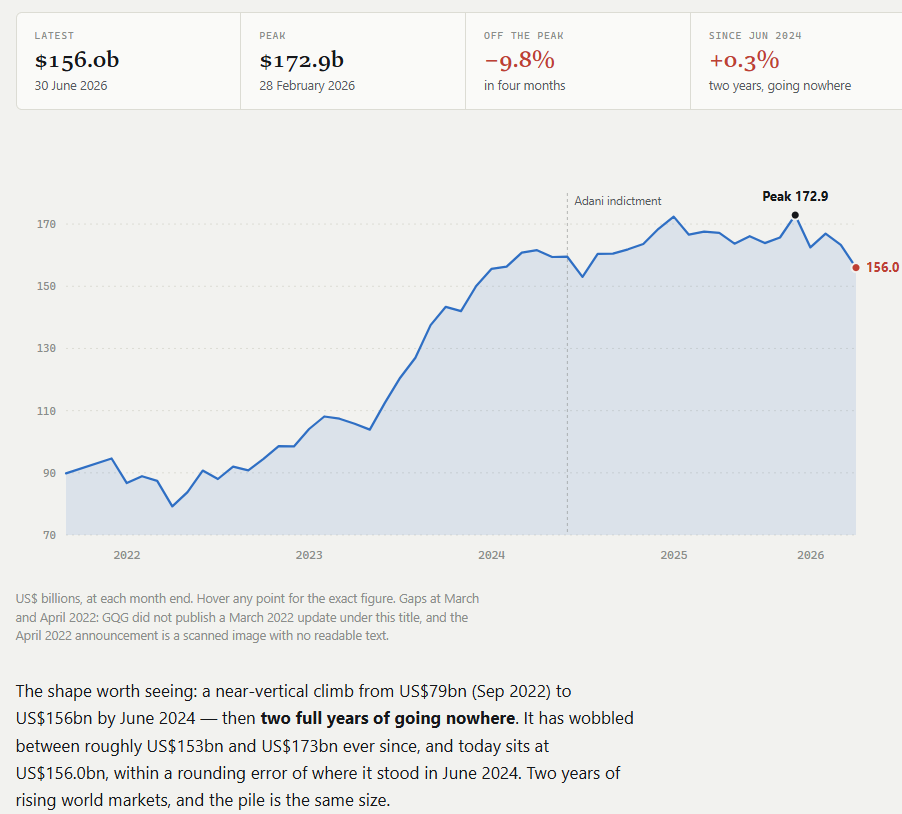
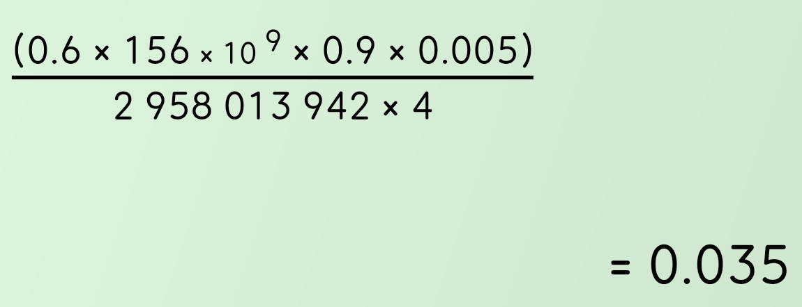

# GQG
## Overview
Traditional active fund manager. GQG doesn't sell a thing you can touch. It rents out trust: it earns a small yearly fee on the $156b people leave with it, and that money can walk out in a month. Trust broke when the Indian tycoon it famously backed was indicted for bribery in 2024. Advisers who steer big pension money got nervous, clients started leaving, $15.1b in six months. Worse, one man owns 70% and is the product, so nobody can outvote him or rescue the price. And investors already remember Magellan collapsing 80% the same way.
## FUN changes

The shape worth seeing: a near-vertical climb from US$79bn (Sep 2022) to US$156bn by June 2024 — then two full years of going nowhere. It has wobbled between roughly US$153bn and US$173bn ever since, and today sits at US$156.0bn, within a rounding error of where it stood in June 2024. Two years of rising world markets, and the pile is the same size.
## Business Model 
**Basics**

- FUM: $156B
- Revenue: 0.5% * FUM
- Margin: 60% (tax, rent, staff etc.)
- dividend payout: 90%
- number of shares: 2,958,013,942
- pay frequency: 4 (quarterly)

**Profit not linear with FUM**
Two reasons:

**1. Harder work costs more.** Picking companies in Brazil and India needs more analysts and travel than buying Apple. So the emerging-markets fund charges **0.7%**; the US fund charges **0.35%** — that one's also competing with index funds at 0.05%, so it can't charge much.
**2. Bulk discount.** A pension fund putting in **$2bn** doesn't pay retail price. Charge them **0.4%** where a small investor pays **0.6%**. Same fund, cheaper by the tonne.

#fundamental_analysis

