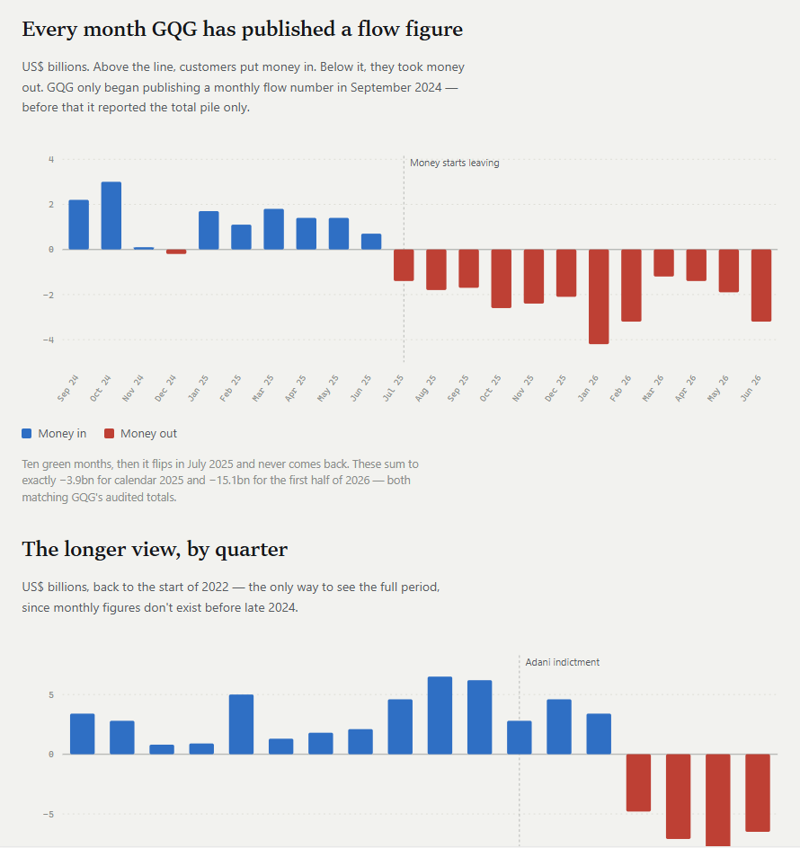

# GQG
## Overview
Traditional active fund manager. GQG doesn't sell a thing you can touch. It rents out trust: it earns a small yearly fee on the $156b people leave with it, and that money can walk out in a month. Trust broke when the Indian tycoon it famously backed was indicted for bribery in 2024. Advisers who steer big pension money got nervous, clients started leaving, $15.1b in six months. Worse, one man owns 70% and is the product, so nobody can outvote him or rescue the price. And investors already remember Magellan collapsing 80% the same way.
## Adani drama
GQG invested on Adani, Adani got charged with fraud, everybody escaped, GQG stayed and even added to their position, Adani got roasted, people started to doubt GQG's judgement, they started to withdraw their money from GQG.
## FUM changes
### What is FUM?
FUM does not mean what they have received from clients, but the market value of their investment + whatever cash they still have. Let's say GQG has received $10 from their client. They invest $8 and keep $2 cash for a rainy day. The investment goes up to $12. Now, it's time they take their 0.5% cut. 0.5% * ($12 + $2) = 7c. 
### Why people withdraw from GQG, but FUM almost flat?
For the reason we explained in the previous section (What is FUM?). People withdrew, BUT the remaining investment went up by almost the same amount. **Don't get fooled by FUM alone. Always look at money outflow and inflow**.

The shape worth seeing: a near-vertical climb from US$79bn (Sep 2022) to US$156bn by June 2024 — then two full years of going nowhere. It has wobbled between roughly US$153bn and US$173bn ever since, and today sits at US$156.0bn, within a rounding error of where it stood in June 2024. Two years of rising world markets, and the pile is the same size.

## Business Model 
**Basics**

- FUM: $156B
- Revenue: 0.5% * FUM
- Margin: 60% (tax, rent, analysts, travels, staff etc.)
- dividend payout: 90%
- number of shares: 2,958,013,942
- pay frequency: 4 (quarterly)

### Profit does not change linearly with FUM!
It's not like they always charge all customers a flat 0.5%. Two reasons:

1. Harder work costs more. Picking companies in Brazil and India needs more analysts and travel than buying Apple. So, the emerging-markets fund charges 0.7%; the US fund charges 0.35% — that one's also competing with index funds at 0.05%, so it can't charge much.
2. Bulk discount. A pension fund putting in $2bn doesn't pay retail price. Charge them 0.4% where a small investor pays 0.6%. Same fund, cheaper by the tonne.

**It's up to the client what product they buy**, so, don't assume GQG *decided* to shift the mixture. 

#### That's why FUM flat but dividend falling!
Dividend has dropped almost 19% for the same period when FUM remained flat. Why? Because, margin changed for the reason we explained in the previous section (Profit does not change linearly with FUM!). 

## Who is Rajiv Jain?
**The setup**
One man — Rajiv Jain — owns **70 of every 100 shares**. He's also the boss *and* the person who picks the investments. Everyone else combined owns 30.

**The buying**
Through September 2025 he bought roughly **A$10m more** on the market, nearly every trading day, at $1.67–$1.77. It's $1.36 now. He's down on every one of those trades.

**Why that's a good sign**
Nobody on earth knows this business better, and he's betting his own cash it comes back. That counts for something.

**Why it's weaker than it looks**
His stake is worth about **A$2.8 billion**. He spent **A$10 million**.

Your bike is worth **$2,800**. You buy it a **$10** bell. Is that a bold statement about the bike?

**What's actually wrong with 70%**

1. **Your vote is worthless.** Everyone else together can't outvote him. Not on strategy, not on the board, not on selling the company.

2. **No rescue.** Normally, when a share gets cheap enough, a rival buys the whole company and you get paid a premium to leave. That can't happen here unless he wants it to. So there's no floor — the price can just keep sliding.

3. **He can't mop up much anyway.** Australian rules limit how fast someone already above 20% can build their stake. So don't sit waiting for him to buy the whole market — he legally can't.

4. **If he goes, it breaks.** Clients hired *him*, not GQG. Illness, retirement, a falling-out — and the money walks out the door. One person is a single point of failure.

**You:** nothing.
**Status:** done.

#fundamental_analysis

